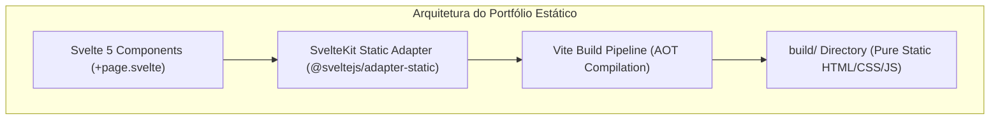

# 🌐 Portfolio Crafting — Runbook Cognitivo

Este runbook orienta desenvolvedores e agentes de IA na manutenção, adição de seções, integração de componentes e compilação estática do portfólio web oficial de Gabriel Frigo ([gabrielfrigo.dev.br](https://gabrielfrigo.dev.br)).

---

## 🏛️ Filosofia & Diretrizes de Design

O portfólio é concebido sob a **Filosofia Anti-Inchaço** e a **Tríade Canônica de Engenharia**:

### Invariantes Estruturais:

1. **Zero Runtime Bloat:** O site DEVE ser 100% estático. Nunca adicione adaptadores baseados em Node SSR ou Cloud Functions sem justificativa arquitetural explícita.
2. **Prerender Total:** Todo endpoint ou rota deve ter `export const prerender = true;`.
3. **Estética Hacker & Perto do Metal:** Dark mode refinado (`#090d13`), fontes monoespaçadas (`Fira Code`), realces em tons de terminal (verde `#7ee787`, azul `#58a6ff`, coral `#ff7b72`, roxo `#d2a8ff`).
4. **Hermetismo de Produção (`rm -rf .agents`):** A pasta `.agents/` serve exclusivamente para orientar o pair programming cognitivo e nunca deve ser referenciada por scripts de compilação ou deploy.

---

## 🛠️ Comandos Canônicos do Repositório

O repositório possui um `Makefile` POSIX estrito:

| Comando        | Descrição                                                                 |
| :------------- | :------------------------------------------------------------------------ |
| `make dev`     | Inicia o servidor local de desenvolvimento Vite (`http://localhost:5173`) |
| `make build`   | Compila o site para artefatos estáticos na pasta `build/`                 |
| `make preview` | Pré-visualiza os arquivos estáticos de produção                           |
| `make format`  | Formata o código com Prettier (`prettier --write .`)                      |
| `make lint`    | Valida formatação estrita com Prettier                                    |
| `make hooks`   | Instala e ativa os git hooks locais em `.githooks/`                       |
| `make ci`      | Executa o pipeline de verificação e build estático                        |
| `make clean`   | Limpa `build/` e `.svelte-kit/`                                           |

---

## 🧭 O Método Socrático com IA

Ao trabalhar no portfólio:

- Nunca assuma que uma biblioteca externa é necessária. Pergunte se a funcionalidade pode ser resolvida com CSS puro ou Svelte 5 nativo (`$state`, `$derived`, `$props`).
- Valide sempre cada modificação com `make format` e `make build`.
- Mantenha o checklist de links externos atualizado e sem URLs quebradas.
