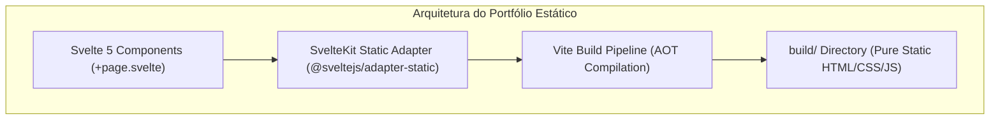

# 🌐 Portfolio Crafting — Runbook Cognitivo

Este runbook orienta desenvolvedores e agentes de IA na manutenção, adição de seções, integração de componentes e compilação estática do portfólio web oficial de Gabriel Frigo ([gabrielfrigo.dev.br](https://gabrielfrigo.dev.br)).

---

## 🏛️ Filosofia & Diretrizes de Design

O portfólio é concebido sob a **Filosofia Anti-Inchaço** e a **Tríade Canônica de Engenharia**:

```mermaid
flowchart TD
    subgraph ARQ ["Arquitetura do Portfólio Estático"]
        S1["Svelte 5 Components (+page.svelte)"]
        S2["SvelteKit Static Adapter (@sveltejs/adapter-static)"]
        S3["Vite Build Pipeline (AOT Compilation)"]
        S4["build/ Directory (Pure Static HTML/CSS/JS)"]
    end

    S1 --> S2 --> S3 --> S4
```

### Invariantes Estruturais:

1. **Zero Runtime Bloat:** O site DEVE ser 100% estático. Nunca adicione adaptadores baseados em Node SSR ou Cloud Functions sem justificativa arquitetural explícita.
2. **Prerender Total:** Todo endpoint ou rota deve ter `export const prerender = true;`.
3. **Estética Hacker & Perto do Metal:** Dark mode refinado (`#090d13`), fontes monoespaçadas (`Fira Code`), realces em tons de terminal (verde `#7ee787`, azul `#58a6ff`, coral `#ff7b72`, roxo `#d2a8ff`).
4. **Hermetismo de Produção (`rm -rf .agents`):** A pasta `.agents/` serve exclusivamente para orientar o pair programming cognitivo e nunca deve ser referenciada por scripts de compilação ou deploy.
5. **Ícones Vetoriais SVG Nativos em Todo o Website (Zero Bloat & Zero Unicode Jitter):** Todo ícone de controle, botão, card, badge ou elemento interativo DEVE ser SVG inline nativo (`viewBox="0 0 24 24"`, `stroke="currentColor"` ou `fill="currentColor"`). Evite instalar bibliotecas de ícones no npm e usar emojis ou caracteres UTF-8 (`⚙`, `↵`, `⏹`, `▾`, `⚡`, `🧠`, `🎲`, `↗`, `↓`) em controles de UI, garantindo determinismo visual idêntico em qualquer plataforma (FreeBSD, Linux, Windows, macOS, Android, iOS).
6. **Código Sem Comentários (Clean Code Declarativo):** Nenhum arquivo de código (`.svelte`, `.js`, `.css`, HTML, `Makefile`, shell scripts) deve carregar comentários (`//`, `/* */`, `<!-- -->`, `#`). O código deve ser tão limpo e declarativo que seu funcionamento é autoevidente. Toda governança e filosofia pertence exclusivamente a documentos `.md`.
7. **Estado da Arte Absoluto (2025/2026) e Proibição de Modelos Legados:** O catálogo de inferência local (WebGPU) e os componentes do website devem refletir estritamente a vanguarda tecnológica dos anos vigentes (**2025/2026**: Google Gemma 3, Alibaba Qwen 3.5, Mistral AI Ministral 3, Microsoft Phi-4, DeepSeek R1). É expressamente proibido sugerir ou adicionar modelos obsoletos ou de safras passadas (como SmolLM de meados de 2024, Llama 3.2, etc.).
8. **Padronização WebGPU (`q4f16_1` & Contexto Adaptativo):** Todos os modelos suportados DEVEM utilizar a quantização canônica `q4f16_1` (pesos em 4 bits e ativações em FP16 nativo com `shader-f16`), com `q4f32_1` estritamente restrito a fallback de compatibilidade. A redução da janela de contexto (`context_window_size: 1024`, `sliding_window_size: 512`) deve ocorrer **exclusivamente em ambientes mobile** (`isMobileDevice`) para blindar contra OOM do sistema operacional; no desktop, o contexto opera em capacidade plena padrão (4.096+ tokens).

---

## 🛠️ Comandos Canônicos do Repositório

O repositório possui um `Makefile` POSIX estrito:

| Comando        | Descrição                                                                 |
| :------------- | :------------------------------------------------------------------------ |
| `make dev`     | Inicia o servidor local de desenvolvimento Vite (`http://localhost:5173`) |
| `make build`   | Compila o site para artefatos estáticos na pasta `build/`                 |
| `make preview` | Pré-visualiza os arquivos estáticos de produção                           |
| `make format`  | Formata o código com Prettier (`prettier --write .`)                      |
| `make lint`    | Valida formatação estrita com Prettier                                    |
| `make hooks`   | Instala e ativa os git hooks locais em `.githooks/`                       |
| `make ci`      | Executa o pipeline de verificação e build estático                        |
| `make clean`   | Limpa `build/` e `.svelte-kit/`                                           |

---

## 🧭 O Método Socrático com IA

Ao trabalhar no portfólio:

- Nunca assuma que uma biblioteca externa é necessária. Pergunte se a funcionalidade pode ser resolvida com CSS puro ou Svelte 5 nativo (`$state`, `$derived`, `$props`).
- Valide sempre cada modificação com `make format` e `make build`.
- Mantenha o checklist de links externos atualizado e sem URLs quebradas.
