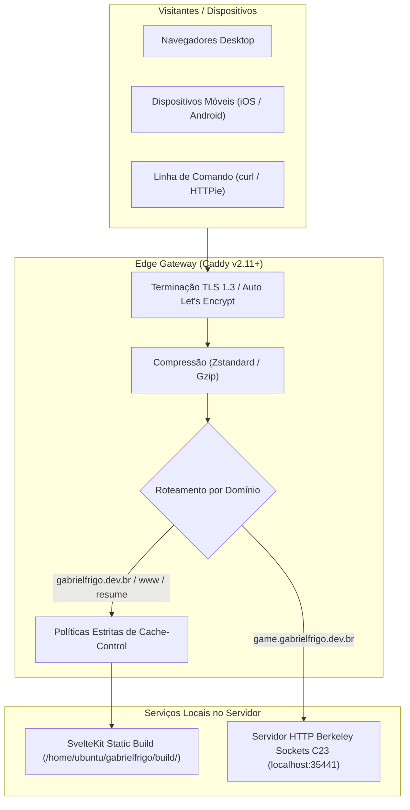
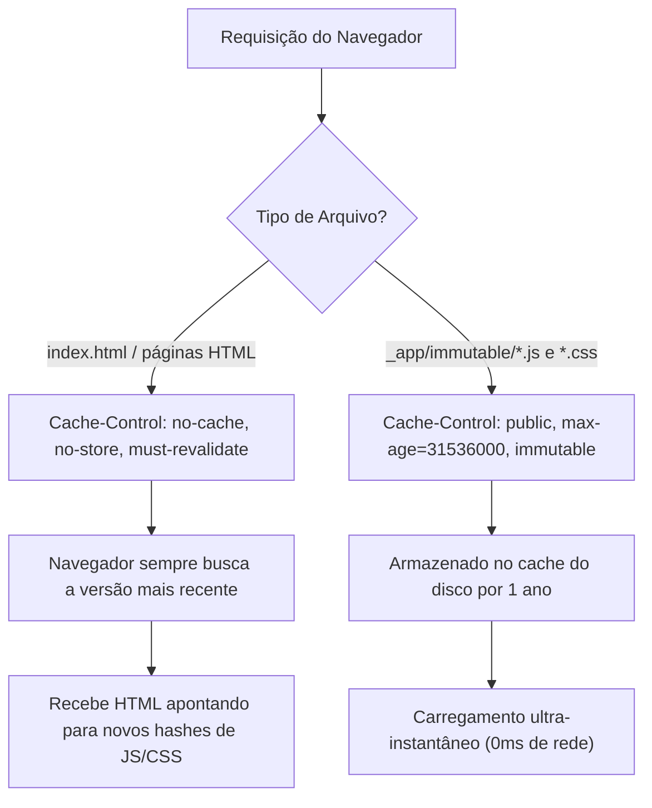

# 🌐 Infraestrutura, Roteamento & Edge Gateway (Caddy)

> Documentação técnica da infraestrutura de hospedagem, terminação TLS, políticas de cache HTTP e proxy reverso do website oficial e laboratórios de Gabriel Frigo ([gabrielfrigo.dev.br](https://gabrielfrigo.dev.br)).

---

## 🏛️ 1. Visão Geral da Topologia Soberana

O ecossistema opera em uma instância em nuvem soberana (Personal Server: `144.22.210.65`), utilizando o **Caddy v2.11+** como servidor web de borda, gerenciador automático de certificados TLS e reverse proxy para backends perto do metal.



---

## 🧭 2. Mapeamento de Domínios & Serviços

| Domínio                          | Papel Arquitetural                  | Destino / Backend                                      | Protocolos                     |
| :------------------------------- | :---------------------------------- | :----------------------------------------------------- | :----------------------------- |
| **`gabrielfrigo.dev.br`**        | Portfólio oficial e WebGPU Chat     | Arquivos estáticos (`/home/ubuntu/gabrielfrigo/build`) | HTTP/2, HTTP/3 (QUIC), TLS 1.3 |
| **`www.gabrielfrigo.dev.br`**    | Alias canônico para a raiz          | Arquivos estáticos (`/home/ubuntu/gabrielfrigo/build`) | HTTP/2, HTTP/3 (QUIC), TLS 1.3 |
| **`resume.gabrielfrigo.dev.br`** | Acesso direto ao acervo curricular  | Arquivos estáticos (`/home/ubuntu/gabrielfrigo/build`) | HTTP/2, HTTP/3 (QUIC), TLS 1.3 |
| **`game.gabrielfrigo.dev.br`**   | Laboratório de Sistemas (unix-sock) | Reverse proxy para `[::1]:35441` (Binário C23)         | HTTP/2, HTTP/3, Unix Sockets   |

---

## 📜 3. O Caddyfile Canônico de Produção

Localizado em `/etc/caddy/Caddyfile` no servidor:

```caddy
# ==============================================================================
# 🌐 Gabriel Frigo — Caddy Webserver & Reverse Proxy Configuration
# Arquivo: /etc/caddy/Caddyfile
# Servidor: Personal Server (144.22.210.65)
# Roteamento: gabrielfrigo.dev.br, www, resume, game
# ==============================================================================

# ------------------------------------------------------------------------------
# 1. Website Oficial e Portfólio Estático (SvelteKit Static / WebGPU Chat)
# ------------------------------------------------------------------------------
gabrielfrigo.dev.br, www.gabrielfrigo.dev.br, resume.gabrielfrigo.dev.br {
	# Raiz dos artefatos pré-renderizados estáticos gerados pelo SvelteKit
	root * /home/ubuntu/gabrielfrigo/build

	# Compressão de alta velocidade: Zstandard (zstd) com fallback para Gzip
	encode zstd gzip

	# Blindagem de Cache para Páginas HTML:
	# O HTML do SPA/SSG NUNCA deve ser retido em cache por browsers para que
	# deploys e atualizações de JavaScript/CSS sejam recebidos instantaneamente.
	@html {
		path *.html / /chat/
	}
	header @html Cache-Control "no-cache, no-store, must-revalidate"

	# Cache Máximo para Artefatos Imutáveis com Hash de Conteúdo:
	# Chunks JS/CSS em /_app/immutable/ possuem hash SHA exclusivo no nome (Vite).
	# Podem e devem ser cacheados por 1 ano (31536000s) sem risco de desatualização.
	@immutable {
		path /_app/immutable/*
	}
	header @immutable Cache-Control "public, max-age=31536000, immutable"

	# Servidor de arquivos estáticos de alta performance
	file_server

	# Roteamento SPA e Tratamento de 404:
	# Tenta servir o arquivo exato; se for diretório tenta /; caso contrário usa /404.html
	try_files {path} {path}/ /404.html
}

# ------------------------------------------------------------------------------
# 2. Laboratório de Sistemas: Servidor HTTP Berkeley Sockets em C23 (unix-sock)
# ------------------------------------------------------------------------------
game.gabrielfrigo.dev.br {
	# Encaminha o tráfego HTTPS público diretamente para o socket local do binário em C23
	reverse_proxy [::1]:35441
}
```

---

## ⚡ 4. A Estratégia de Cache: O Dilema de SPAs & SSGs

Aplicações estáticas modernas compiladas com empacotadores como Vite e SvelteKit possuem uma dinâmica específica de cache que exige configuração explícita:



### Por que essa configuração é crucial?

1. **Prevenção do 'Cache Drift' em Dispositivos Móveis:**
   Navegadores móveis (Safari iOS, Chrome Android) realizam cache agressivo de arquivos `.html` se nenhum cabeçalho for informado. Isso faz com que, mesmo após um deploy bem-sucedido, o visitante continue vendo a versão antiga de layouts, botões e scripts.
2. **Imutabilidade Real com Conteúdo Hashed:**
   O Vite gera nomes de arquivo como `3.WlzF9J3I.js` baseados no hash do conteúdo. Se o código muda, o nome do arquivo muda. Portanto, podemos dizer com segurança ao navegador para armazená-lo por 1 ano (`immutable`), pois nunca haverá conflito de versão.

---

## 🛠️ 5. Comandos Operacionais & Manutenção no Servidor

Conectado ao servidor via SSH (`ssh -i ... ubuntu@144.22.210.65`):

```bash
# Validar sintaxe do Caddyfile sem interromper o serviço
caddy validate --config /etc/caddy/Caddyfile

# Recarregar configuração do Caddy com zero downtime (hot reload)
sudo systemctl reload caddy

# Verificar status operacional e portas em escuta
sudo systemctl status caddy

# Acompanhar logs de acesso e erros em tempo real
journalctl -u caddy -f -n 50
```

---

## 🚀 6. Fluxo de Publicação (`make deploy`)

Atualmente, o deploy sincroniza a pasta local compilada `build/` diretamente para o servidor via SSH:

```bash
# Executa compilação e sincronização atômica
make deploy
```

O script [`update-server.sh`](update-server.sh) executa:

1. Validação das variáveis de ambiente (`PERSONAL_SERVER_IP`, `PERSONAL_SERVER_USER`, `PERSONAL_SERVER_KEY`).
2. Sincronização segura via `scp -r build/ ubuntu@144.22.210.65:/home/ubuntu/gabrielfrigo/build`.
3. O Caddy serve os arquivos imediatamente a partir do diretório raiz.
