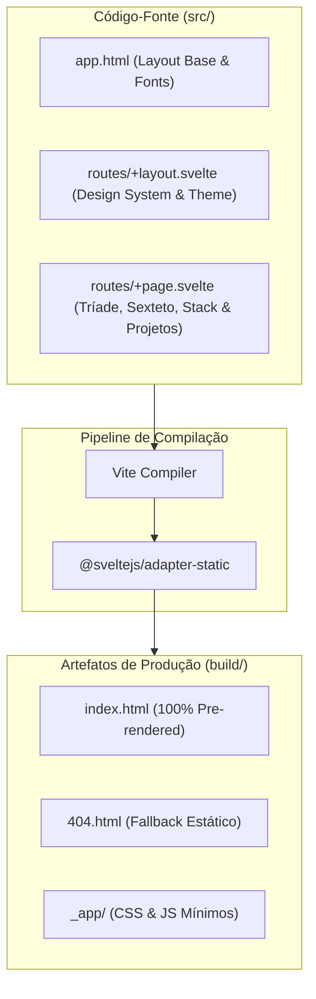

<div align="center">

# 🌐 Gabriel Frigo — Website & Portfólio Pessoal

[](https://svelte.dev/)
[](https://kit.svelte.dev/)
[](https://vitejs.dev/)
[](https://prettier.io/)
[](LICENSE)

<p align="center">
  <strong>Website oficial e portfólio de engenharia de sistemas, fundamentos de UNIX, computação gráfica e otimização combinatória de Gabriel Frigo.</strong>
</p>

[**🌐 Acessar Website (gabrielfrigo.dev.br)**](https://gabrielfrigo.dev.br) •
[**📚 AGENTS.md**](AGENTS.md) •
[**📜 PRINCIPLES.md**](PRINCIPLES.md)

</div>

---

## 🏛️ Visão Geral & Filosofia

Este repositório contém o código-fonte do website oficial de **Gabriel Frigo**. Projetado do zero sob a **Filosofia Anti-Inchaço (Zero Runtime Bloat)**, o site utiliza **SvelteKit** com o adaptador estático (`@sveltejs/adapter-static`), transformando os componentes em HTML, CSS e JavaScript puros em tempo de compilação.

### Pilares Fundamentais:

1. **Fundamentos de UNIX:** Primitivas elementares de File Descriptors (FD) e Identifiers (ID), Open Sound System (OSS) via `/dev/dsp`, Privilege Separation (`pledge`/`unveil`, Capsicum).
2. **Perto do Metal:** Mínimo denominador comum com `POSIX.1` e `SDL3` (SDL_GPU, SDL_Audio, WebGPU), sem camadas intermediárias inchadas.
3. **Compilador Determinístico:** Garantias matemáticas formais em C23, C++23, Rust, Zig, Go e Svelte superam qualquer dependência dinâmica em tempo de execução.
4. **O Método Socrático com IA:** Tutoria ativa via suíte Antigravity (CLI, IDE, 2.0 e SDK) orientada por questionamento contínuo (100% de certeza).

---

## 📐 Arquitetura



---

## 🚀 Como Executar Localmente

### Pré-requisitos

- Node.js (v20+ recomendado)
- npm (v10+)
- `make` (POSIX compatível)

### Comandos Rápidos

```sh
# 1. Instalar dependências
npm install

# 2. Ativar os quality gates locais (Git Hooks)
make hooks

# 3. Iniciar servidor de desenvolvimento
make dev

# 4. Compilar artefatos estáticos de produção
make build

# 5. Pré-visualizar a compilação estática
make preview
```

---

## 🧭 O Sexteto Federado

| Repositório       | Papel                                                          | Link                                                                      |
| :---------------- | :------------------------------------------------------------- | :------------------------------------------------------------------------ |
| **`environment`** | Orquestrador de estações de trabalho e dotfiles soberanos      | [GabrielFrigo4/environment](https://github.com/GabrielFrigo4/environment) |
| **`foundation`**  | Utilitários de sistema C99/POSIX.1 e preservação digital       | [GabrielFrigo4/foundation](https://github.com/GabrielFrigo4/foundation)   |
| **`research`**    | Pesquisa acadêmica em Otimização Combinatória (PIBIC)          | [GabrielFrigo4/research](https://github.com/GabrielFrigo4/research)       |
| **`training`**    | Maratonas de programação competitiva (ICPC 2026) & cpt CLI     | [GabrielFrigo4/training](https://github.com/GabrielFrigo4/training)       |
| **`personal`**    | Laboratório de computação gráfica e Standard BSD Library (C23) | [GabrielFrigo4/personal](https://github.com/GabrielFrigo4/personal)       |
| **`venture`**     | Produtos digitais de mercado e roteirização com OR-Tools       | [GabrielFrigo4/venture](https://github.com/GabrielFrigo4/venture)         |

---

## 📜 Licença

Distribuído sob a licença **MIT**. Veja [`LICENSE`](LICENSE) para mais detalhes.
