# 📋 Backlog & Roadmap Técnico — Gabriel Frigo Portfolio

> Registro formal de arquitetura, melhorias planejadas e tarefas pendentes para o portfólio oficial ([gabrielfrigo.dev.br](https://gabrielfrigo.dev.br)), mantendo fidelidade estrita à **Filosofia Anti-Inchaço**, **Fundamentos de UNIX** e **Engenharia Soberana**.

---

## 🎯 Meta Prioritária: Pipeline de CI/CD Seguro com Deploy Automático (Modelo A)

> **Objetivo:** Automatizar a publicação do portfólio para que todo `git push origin main` execute os quality gates e sincronize automaticamente os artefatos estáticos (`build/`) com o servidor de produção em nuvem soberana (`ubuntu@144.22.210.65`), com **zero intervenção manual** e **defesa em profundidade**.

```mermaid
flowchart LR
    subgraph LOCAL ["Estação Soberana (FreeBSD)"]
        DEV["Dev & Pair Programming"]
        GATE["pre-commit Hooks"]
        PUSH["git push origin main"]
        DEV --> GATE --> PUSH
    end

    subgraph GITHUB ["GitHub Actions (CI/CD Seguro)"]
        CI["1. Lint & Test (Prettier + SvelteKit Build)"]
        VERIFY["2. Verificação de Integridade dos Artefatos"]
        AGENT["3. Carregar Chave SSH Isolada (GitHub Secrets)"]
        DEPLOY["4. Sincronização Segura via rsync/scp"]
        PUSH --> CI --> VERIFY --> AGENT --> DEPLOY
    end

    subgraph SERVER ["Servidor de Produção (Ubuntu / Caddy)"]
        AUTH["~/.ssh/authorized_keys (Restrito)"]
        BUILD["/home/ubuntu/gabrielfrigo/build"]
        CADDY["Caddy Server (Cache-Control no-cache)"]
        DEPLOY --> AUTH --> BUILD --> CADDY
    end
```



---

### 🛡️ Princípios de Segurança & Defesa em Profundidade

1. **Princípio do Menor Privilégio (Privilege Separation):**
    - **NUNCA** utilizar a chave SSH principal de administração do servidor (`ssh-key-personal-server.key`).
    - Criar um par de chaves SSH `ed25519` dedicado exclusivamente para o GitHub Actions, sem permissões de `sudo` e sem acesso a outros serviços do servidor.
2. **Restrições Rígidas no `authorized_keys`:**
    - A chave no servidor deve possuir diretivas de restrição no arquivo `~/.ssh/authorized_keys`:
        ```text
        no-port-forwarding,no-X11-forwarding,no-agent-forwarding,no-pty ssh-ed25519 <PUBLIC_KEY_DEPLOY> github-actions-portfolio-deploy
        ```
3. **Isolamento de Diretório:**
    - A sincronização afeta exclusivamente o diretório `/home/ubuntu/gabrielfrigo/build/`. Nenhum arquivo de configuração de sistema (`/etc/caddy`, etc.) fica acessível pela chave de deploy.
4. **Proteção de Branch & Secrets no GitHub:**
    - Apenas execuções vindas da branch protegida `main` terão acesso aos Secrets (`PERSONAL_SERVER_KEY`).

---

### 📝 Runbook Passo a Passo para Execução Futura

#### Passo 1: Gerar o Par de Chaves Dedicado na Máquina Local

```bash
# Gerar chave ed25519 isolada sem passphrase para o bot de CI
ssh-keygen -t ed25519 -C "github-actions-portfolio-deploy" -f ~/.ssh/id_ed25519_portfolio_deploy
```

#### Passo 2: Instalar a Chave Pública no Servidor com Restrições

No servidor (`ubuntu@144.22.210.65`), anexar a chave pública com restrições em `~/.ssh/authorized_keys`:

```bash
# Linha a ser adicionada no ~/.ssh/authorized_keys do servidor:
no-port-forwarding,no-X11-forwarding,no-agent-forwarding,no-pty ssh-ed25519 AAAA... github-actions-portfolio-deploy
```

#### Passo 3: Cadastrar os Segredos no GitHub Repository

No repositório `GabrielFrigo4/gabrielfrigo` (Settings → Secrets and variables → Actions):

- `PERSONAL_SERVER_IP`: `144.22.210.65`
- `PERSONAL_SERVER_USER`: `ubuntu`
- `PERSONAL_SERVER_PORT`: `22`
- `PERSONAL_SERVER_KEY`: _(Conteúdo privado da chave `id_ed25519_portfolio_deploy`)_

#### Passo 4: Atualizar `.github/workflows/ci.yml` para Adicionar o Job de CD

Adicionar o job de deploy condicionado ao sucesso do build na branch `main`:

```yaml
deploy:
    name: 🚀 Production Deploy (Push SSH)
    needs: validate-and-build
    if: github.ref == 'refs/heads/main' && github.event_name == 'push'
    runs-on: ubuntu-latest

    steps:
        - name: Checkout Code
          uses: actions/checkout@v4

        - name: Set up Node.js
          uses: actions/setup-node@v4
          with:
              node-version: 22
              cache: "npm"

        - name: Install Dependencies
          run: npm ci

        - name: Build Static SvelteKit Site
          run: npm run build

        - name: Set up SSH Agent
          uses: webfactory/ssh-agent@v0.9.0
          with:
              ssh-private-key: ${{ secrets.PERSONAL_SERVER_KEY }}

        - name: Add Server to Known Hosts
          run: |
              mkdir -p ~/.ssh
              ssh-keyscan -p ${{ secrets.PERSONAL_SERVER_PORT || 22 }} -H ${{ secrets.PERSONAL_SERVER_IP }} >> ~/.ssh/known_hosts

        - name: Sync Static Build to Server (Atomic rsync)
          run: |
              rsync -avz --delete \
                -e "ssh -p ${{ secrets.PERSONAL_SERVER_PORT || 22 }}" \
                build/ \
                ${{ secrets.PERSONAL_SERVER_USER }}@${{ secrets.PERSONAL_SERVER_IP }}:/home/${{ secrets.PERSONAL_SERVER_USER }}/gabrielfrigo/build/

        - name: Health Check Deployment
          run: |
              sleep 2
              STATUS_CODE=$(curl -s -o /dev/null -w "%{http_code}" https://gabrielfrigo.dev.br/chat/)
              if [ "$STATUS_CODE" != "200" ]; then
                echo "❌ Health check failed with status $STATUS_CODE"
                exit 1
              fi
              echo "✅ Production deployment verified! Status $STATUS_CODE"
```

#### Passo 5: Validação & Teste de Fogo

- Fazer um commit de teste na `main`.
- Acompanhar a execução da GitHub Action.
- Verificar se o site `https://gabrielfrigo.dev.br/chat/` é atualizado em menos de 45 segundos.

---

## 📌 Outras Tarefas do Backlog

- [x] **Geometria Estável de Botões:** Eliminar jitter de largura/altura nas transições de estado no chat web.
- [x] **Ícones Vetoriais SVG Nativos:** Banir glifos Unicode (`↵`, `⏹`) e pacotes de ícones externos do npm em favor de SVGs inline nativos.
- [x] **Responsividade Mobile no Chat Web:** Correção de overflow horizontal na navbar, whisper telemetry e blocos `<pre>`.
- [x] **Blindagem de Cache HTTP:** Adição de `Cache-Control: no-cache` em HTMLs e `immutable` em assets versionados no Caddy.
- [ ] **Automação de CI/CD Completa:** Executar o pipeline do Modelo A detalhado acima.
- [ ] **Cache de Shaders WebGPU Offline:** Implementar persistência local de shaders compilados via IndexedDB/Cache API para acelerar cold start do WebLLM.
- [ ] **Modo Alto Contraste:** Adicionar suporte sutil a `prefers-contrast` no CSS canônico.
